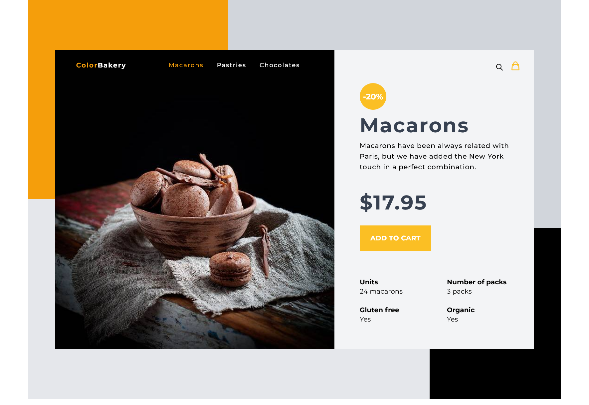

# Bakery

A little Vue app

<br/>
<p align="center">Tools used</p>

# Vite ⚡

- 💡 Component
- ⚡️ Lightning Fast HMR
- 📦 Optimized Build
- 🔑 Fully Typed APIs

<br>

# WindiCSS ⚡

- 💡 for styles

<br/>

# vite-plugin-pages ⚡

- 💡 for working with categories

<br/>
<center>

</center>
<br/>

## Run Locally

Clone the project

```bash
  git clone https://github.com/Paracells/Bakery.git
```

Go to the project directory

```bash
  cd my-project
```

Install dependencies

```bash
  pnpm install
```

Start the server

```bash
  pnpm run start
```

# License

MIT
